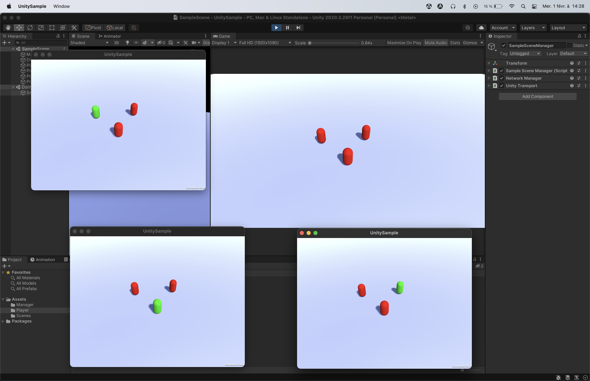

# PredictionReconciliationNetwork 1.2.0

## Summary

1. [Purpose](#purpose)
2. [Changelog](#changelog)
3. [Import](#import)
4. [Usage](#usage)<br/>a. [Processor, Input and State](#processor-input-and-state)<br/>b. [StateConsistencyChecker](#stateconsistencychecker)<br/>c. [InputProvider](#inputprovider)<br/>d. [NetworkHandler](#networkhandler)
5. [What's next](#whats-next)
6. [Conclusion](#conclusion)

## Purpose

This C# project goal is to simplify online multiplayer games with Client-side prediction and Server reconciliation.
It can be adapted in any languages as it is not bound to any engine (even though I've written it to work with Unity)

## Changelog

<details>
<summary><b>1.2.0 (05/03/2024)</b></summary>

- [Added] 

	- StateSyncPolicy : 

		You can provide a StateSyncPolicy to a NetworkHandler constructor.

		`StateSyncPolicy.catchUpThreshold` (default = 10) determins the max state count a Guest is left behind. When reaching this value, all pending states will be applied. Otherwise, only one state is applied.

		`StateSyncPolicy.withPrediction` (default = false) allows the Guest to uses the last input received from the server to generate a state every tick, which can be usefull with a low tick rate update.

	- Anti hack

		NetworkHandler event `onTickerHackerDetected` is called server-side when it detects a client sending more inputs that it should be allowed to (regarding the handler's tick rate).

		In the sample, I'm showing a way do deal with it : Simply kick the f*cker
		```
		networkHandler.onTickerHackerDetected += () => {
			NetworkObject.Despawn();
		};
		```
</details>

## Import

Go to the [Release](https://github.com/TCleard/PredictionReconciliationNetwork/releases) page, download the latest .dll and import it into your project (for Unity, under the Assets folder).
You can also pull this repository directly into your project.

## Usage

### Processor, Input and State

A **processor** holds the core logic of the object you need to sync over the network. It takes an Input as a parameter, and returns a State. It will also reconcile your client if there's inconsistency between the server and the client.
An **input** is simply the instruction your processor needs to perform an action. It needs a **tick** value to inform the server *when* it's created.
A **state** is the result of this processing, and needs the input's **tick** value so the client knows how far the reconciliation has to go in case of unconsistency between the server and the client.
Those **tick** values are set by the lib.

Example (for Unity) :

```C#
// Your Input
public struct NetworkPlayerInput : PRN.IInput
{

    public int tick;
    public int forward;
    public int right;
    public bool jump;

    // You need to implement those 2 methods
    public void SetTick(int tick) => this.tick = tick;
    public int GetTick() => tick;

}

// Your State
public struct NetworkPlayerState: PRN.IState {

	public int tick;
	public Vector3 position;
	public Vector3 movement;
	public Vector3 gravity;

	// You need to implement those 2 methods
	public void SetTick(int tick) => this.tick = tick;
	public int GetTick() => tick;

}

// Your Processor
public class NetworkPlayerProcessor: MonoBehaviour, PRN.IProcessor<NetworkPlayerInput, NetworkPlayerState> {

	private CharacterController controller;

	[SerializeField]
	private float movementSpeed = 8f;
	[SerializeField]
	private float jumpHeight = 2.5f;

	[SerializeField]
	private float gravityForce = -9.81f;

	public Vector3 movement = Vector3.zero;
	public Vector3 gravity = Vector3.zero;

	private void Awake() {
		controller = GetComponent<CharacterController>();
	}

	// You need to implement this method
	// Your player logic happens here
	public NetworkPlayerState Process(NetworkPlayerInput input, TimeSpan deltaTime) {
		movement = (Vector3.forward * input.forward + Vector3.right * input.right).normalized * movementSpeed * (float) deltaTime.TotalSeconds;
		if (controller.isGrounded) {
			gravity = Vector3.zero;
			if (input.jump) {
				gravity = Vector3.up * Mathf.Sqrt(jumpHeight * 2 * -gravityForce) * (float) deltaTime.TotalSeconds;
			}
        }
		if (gravity.y > 0) {
			gravity += Vector3.up * gravityForce * Mathf.Pow((float) deltaTime.TotalSeconds, 2);
		} else {
			gravity += Vector3.up * gravityForce * Mathf.Pow((float) deltaTime.TotalSeconds, 2) * 1.3f;
		}
		controller.Move(movement + gravity);
		return new NetworkPlayerState() {
			position = transform.position,
			movement = movement,
			gravity = gravity
		};
	}

	// You need to implement this method
	// Called when an inconsistency occures
	public void Rewind(PlayerState state) {
		controller.enabled = false;
		transform.position = state.position;
		movement = state.movement;
		gravity = state.gravity;
		controller.enabled = true;
	}

}
```

### StateConsistencyChecker

When an **input** is processed by a client, it generates a **state** that updates directly the client. It is required to also send this input to the server, so it's processed server-side. The server will so generates its own state, and will send it back to the client. The client then needs to know if he has correctly predicted the state.

```C#
public class NetworkPlayerStateConsistencyChecker: MonoBehaviour, PRN.IStateConsistencyChecker<NetworkPlayerState> {

	// You need to implement this method
	// serverState is the one sent back by the server to the client
	// ownerState is the corresponding state the client predicted (they have the same tick value)
	public bool IsConsistent(NetworkPlayerState serverState, NetworkPlayerState ownerState) =>
		Vector3.Distance(serverState.position, ownerState.position) <= .01f
			&& Vector3.Distance(serverState.movement, ownerState.movement) <= .01f
			&& Vector3.Distance(serverState.gravity, ownerState.gravity) <= .01f;

}
```
If this method return false, then there's an inconsistency. The lib will automatically called the Processor.**Rewind** method with the server state to restore, syncing the server and the client, and then all the client inputs that has been processed since this state.tick will be reapplied.

### InputProvider
To provide an **input** to the processor, you'll need an **InputProvider**.

```C#
public class NetworkPlayerInputProvider: MonoBehaviour, PRN.IInputProvider<NetworkPlayerInput> {

	private NetworkPlayerInput input;
	public bool pendingJump = false;

	private void Update() {
		input.forward = (Input.GetKey(KeyCode.Z) ? 1 : 0) - (Input.GetKey(KeyCode.S) ? 1 : 0);
		input.right = (Input.GetKey(KeyCode.D) ? 1 : 0) - (Input.GetKey(KeyCode.Q) ? 1 : 0);
		pendingJump |= Input.GetKeyDown(KeyCode.Space);
	}

	// You need to implement this method
	public NetworkPlayerInput GetInput() {
		input.jump = pendingJump;
		pendingJump = false;
		return input;
	}

}
```
Note : You don't need to take care of the Input.**tick** value, as it is automatically set by the lib.

### NetworkHandler
The NetworkHandler is where the magic happens (almost).
It has multiple roles :
* Server : 
	* receives an input from a client
	* generates the corresponding state
	* sends the state to the clients
	* notify if someone managed to hack throught the ticker rate to send more inputs that he should be
* Owner : 
	* your local player
	* predicts a state based on his own input
	* sends his input to the server
	* reconciles its state if there's an inconsistency with the server
* Host :
	* your local player, but also acts as a server
	* no reconciliation on this side
* Guest :
	* just receives states

It needs a **Ticker** to know the state update frequency, and to ensure every connected players and the server run at the same speed.
```C#
PRN.Ticker ticker = new PRN.Ticker(TimeSpan.FromSeconds(1 / 60f));
```
To make it *tick*, you need to tell it when time passes by
```C#
public class NetworkPlayer: MonoBehaviour {

	private const float PROCESS_TICK_RATE = 1 / 120f;

	private PRN.Ticker processTicker = new Ticker(TimeSpan.FromSeconds(PROCESS_TICK_RATE));	
	private void FixedUpdate() {
		processTicker.OnTimePassed(TimeSpan.FromSeconds(Time.fixedDeltaTime));
	}

}
```

Now, you have everything to create your NetworkHandler.
I'll show you how to use it with [Netcode For GameObjects](https://github.com/Unity-Technologies/com.unity.netcode.gameobjects)
```C#
public class NetworkPlayer: NetworkBehaviour {

	/**
	Ticker
	**/

	private NetworkPlayerProcessor processor;
	private NetworkPlayerInputProvider inputProvider;
	private NetworkPlayerStateConsistencyChecker consistencyChecker;

	private NetworkHandler<NetworkPlayerInput, NetworkPlayerState> networkHandler;

	private void Awake() {
		processor = GetComponent<NetworkPlayerProcessor>();
		inputProvider = GetComponent<NetworkPlayerInputProvider>();
		consistencyChecker = GetComponent<NetworkPlayerStateConsistencyChecker>();
	}
	
	public override void OnNetworkSpawn() {
		base.OnNetworkSpawn();

		NetworkRole role;
		if (IsServer) {
			role = IsOwner ? NetworkRole.HOST : NetworkRole.SERVER;
		} else {
			role = IsOwner ? NetworkRole.OWNER : NetworkRole.GUEST;
		}
		networkHandler = new NetworkHandler<NetworkPlayerInput, NetworkPlayerState>(
			role: role,
			ticker: ticker,
			processor: processor,
			inputProvider: inputProvider,
			consistencyChecker: consistencyChecker
		);
	}

	[...]

}
```

You are almost done ! 

You now need to synchronise all the inputs and state :

```C#
public class Player: NetworkBehaviour {

	[...]
	
	public override void OnNetworkSpawn() {
		[...]
		networkHandler.onSendInputToServer += SendInputServerRpc;
		networkHandler.onSendStateToClient += SendStateClientRpc;
	}
	
    [ServerRpc]
    private void SendInputServerRpc(PlayerInput input)
    {
        networkHandler.OnOwnerInputReceived(input);
    }

    [ClientRpc]
    private void SendStateClientRpc(PlayerState state)
    {
        networkHandler.OnServerStateReceived(state);
    }

	[...]
}
```

In order to send inputs and states throught Netcode RPC calls, your inputs and states need to implements Unity.Netcode.INetworkSerializable :


```C#
public struct NetworkPlayerInput: PRN.IInput, Unity.Netcode.INetworkSerializable {
	
	[...]

    public void NetworkSerialize<T>(BufferSerializer<T> serializer) where T : IReaderWriter {
        serializer.SerializeValue(ref tick);
        serializer.SerializeValue(ref forward);
        serializer.SerializeValue(ref right);
        serializer.SerializeValue(ref jump);
    }

}

public struct NetworkPlayerState: PRN.IState, Unity.Netcode.INetworkSerializable {

	[...]

    public void NetworkSerialize<T>(BufferSerializer<T> serializer) where T : IReaderWriter {
        serializer.SerializeValue(ref tick);
        serializer.SerializeValue(ref position);
        serializer.SerializeValue(ref movement);
        serializer.SerializeValue(ref gravity);
	}
	
}

```

Now that your data is synced between the server and the clients, your player should now move on the server and other clients.

If you need to perform specific tasks when a state is processed, you can subscribe to the **onState** action on the network handler.

```C#
public class NetworkPlayer: NetworkBehaviour {

	[...]
	
	protected override void OnNetworkSpawn() {
		[...]
		networkHandler.onState += OnState;
	}

	private void OnState(PlayerState state) {
		// Do whatever you need
		// This method is called on the server or the host when they generate a state
		// on the owner when it predicts a state and during its reconciliation
		// on the client when it receives a state from the server
	}

	[...]
}
```

One final thing : When your object is destroyed, it is still somehow bounded to the Ticker. To prevent any errors, in the `OnDestroy` method of you NetworkBehaviour, you should call `networkHandler.Dispose()`.

```C#
public class NetworkPlayer: NetworkBehaviour {

	[...]
	
	public override void OnDestroy() {
		base.OnDestroy();
		networkHandler.Dispose();
	}

}
```

## Sample
You can download the example project above in the [UnitySample](https://github.com/TCleard/PredictionReconciliationNetwork/tree/main/UnitySample) folder.

Put the .dll into the Assets folder, then run the game. Press S to start as a server, H as an host and C as a client. Press Escape to disconnect.

Build the project and run the executable and the game in Unity to test everything.

On the following screenshot, the Unity instance is running as a server, and the 3 builds as clients.



## What's next

Knowing that every one is playing in the past of other clients (you are live, but you see old states of others clients, even the server is behind), my next goal is to create a way to extrapolate a client's state on the owner / host / server side. Right now, if you create a FPS game with this lib, if you shoot at someone, you're in fact shooting on its past position, the server might not register any hit on your target. With an extrapolation on a client state, you can predict where it would be, so the owner would see a predicted futur position of the client he is aiming at.

## Conclusion

I hope I didn't forget anything, and that it's clear enough. Feel free to open a PR if you have any question, modification request, or whatever :D

A little wink and a big thanks to [Ajackster](https://www.youtube.com/@Ajackster) for helping me understand Prediction Reconciliation with [this video](https://www.youtube.com/watch?v=TFLD9HWOc2k&t=14s&ab_channel=Ajackster) (which I highly recommend you to watch), who greatly inspired this project (<s>some</s> most of my code is in fact his)
Also, thanks to Unity for providing Netcode for GameObjects ([Documentation](https://docs-multiplayer.unity3d.com/netcode/current/about/index.html), [GitHub](https://github.com/Unity-Technologies/com.unity.netcode.gameobjects)), it motivated me to try and develop online games.
